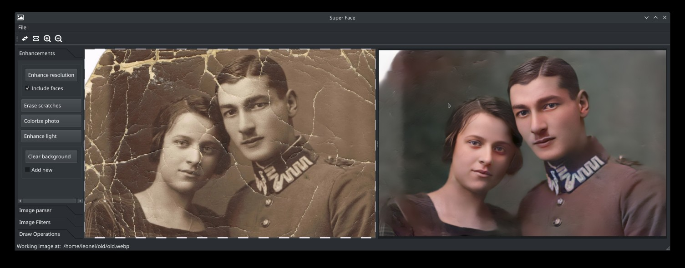

# Super Face

### IA front-end for photo restoration, no cloud services needed. 

At this point of the development phase it include five features for photo enhancement:

- **Super Resolution**, this feature transform low resolution photos to hi resolution photos using **GAN Networks**, besides this feature have the option to perform an special enhancement for faces given more detailed view of the face features just like eyes, nose, hair.

- **Erase Scratches**, this feature detects scratches over a photo and try to delete it predicting how had would looks like the original.  

- **Colorize Photo**, this feature turn black and white photos into color photo.

- **Enhance lights**, this feature try to give a darker or low light photo a better light enhancement 

- **Clear background**, this feature clear the background of a photo keeping only persons in the photo, also it can put a custom background.

The next development phase will be create and easy way of distribute packaging on an stand alone App.  

